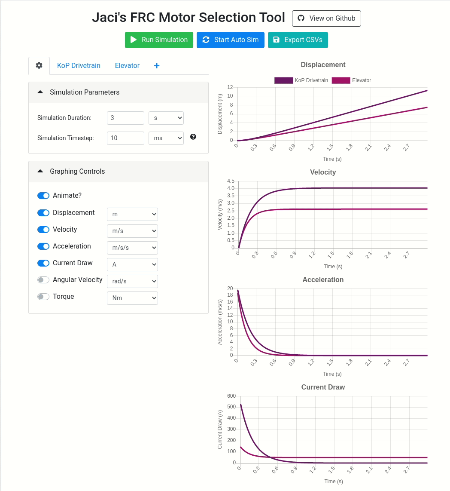

# Jaci's FRC Motor Modelling and Selection Tool
Inform your choice of FRC motor by simulating how they will respond on any given load.

## What it does
This simple web app simulates motor response for a specified load and configuration. It models the following parameters:
- Displacement (distance travelled)
- Velocity (angular + linear)
- Acceleration
- Torque
- Current Draw

The current version works for linear loads; those in systems with a drum, pulley, or wheel such as a drivetrain or elevator.

Furthermore, it has the following features:
- Live simulation updates
- Export simulation data as CSV (_note: all CSV units are in metric_)
- Easy comparison of different configurations so you can see how gearbox and motor choices compare to each other

## What it doesn't
- Angular loads (e.g. shooters) - planned
- Arbitrary motor import - planned
- Saving / Loading of configurations - planned